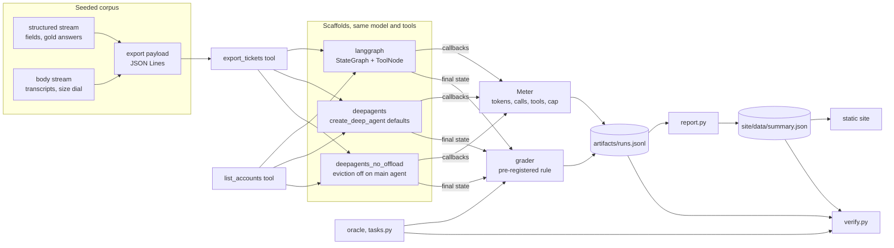

# Architecture — LangGraph vs Deep Agents: context under pressure

## Overview

A small Python harness runs the same eight account-audit questions through three agent scaffolds
built on one model object. It meters every model call, grades each run's final answer against an
oracle, and writes one JSON record per run to `artifacts/runs.jsonl`. A report step turns that
file into `site/data/summary.json`. A static page renders it, and a verifier re-derives all of it
offline.

## System diagram

## Components

| Component | Responsibility | Tech |
|---|---|---|
| `data.py` | Six-account, 240-ticket corpus from two seeded streams; `export_payload(account, size)` | stdlib `random`, `json` |
| `tasks.py` | Eight questions, oracle answers, validity constraints the seed search enforces | stdlib |
| `arms.py` | Tool definitions and the three scaffolds | `langgraph` 1.2.12, `deepagents` 0.7.19 |
| `metering.py` | Callback: model calls (with a 40-call cap), input/cached/output/reasoning tokens, per-call input sizes, tool calls, reads of evicted files | `langchain-core` callbacks |
| `grading.py` | Final-answer extraction, normalisation, outcome classes, exception classifier | stdlib `re` |
| `runner.py` | Plans and shuffles runs, runs 3 at a time, enforces the $ budget, resumes, scrubs secrets | `ThreadPoolExecutor` |
| `fake_model.py` | Scripted offline chat model that simulates the per-request ceiling | `BaseChatModel` |
| `report.py` | `runs.jsonl` → `summary.json` (accuracy + Wilson CIs, cost, peaks, outcomes) | stdlib |
| `verify.py` | Re-derives every published number with no key | stdlib |
| `site/` | Static page: three charts, tables, run explorer | plain HTML/CSS/JS, inline SVG |

## Data flow

1. The runner builds a fresh graph per run with `arms.build(arm, model, size)`. The `size` is bound
   into the `export_tickets` closure, so the model sees the same tool name and schema at every size.
2. `graph.invoke({"messages": [HumanMessage(question)]})` runs with an `InMemorySaver` checkpointer
   and a `Meter` in `callbacks`. Callbacks propagate into Deep Agents' `task` subagents and its
   summarisation calls, so their tokens count against the run.
3. The final state comes from the checkpointer, **even when the run raised**. A run that hit the
   context ceiling still has a trajectory up to the rejected call.
4. The grader scores normal endings. Exceptions go through `classify_exception`. Both are written
   into the record along with the metered snapshot and a compacted trajectory.

## The measurement layer

Everything published comes from two sources that don't depend on either framework's own
reporting:

- **Tokens and cost** come from the provider's `usage_metadata` on each model response, collected
  by a LangChain callback. LangGraph and Deep Agents both run through the same callback system, so
  neither scaffold reports its own numbers. Cost is computed from tokens at published list prices.
  There's no balance endpoint read.
- **Correctness** comes from `tasks.py`'s oracle over the structured corpus, never from a model.

The seam for a second model or provider is `runner.make_model()`. Any `BaseChatModel` that reports
`usage_metadata` drops in, and the grader, metering and report don't change. A second scaffold is
one more branch in `arms.build()`.

**Eviction detection.** A `ToolMessage` from `export_tickets` in the main graph's state that
contains `/large_tool_results/` counts as offloaded. Subagent histories aren't in the main state,
so offloading *inside* a subagent isn't counted. Reads of evicted files are counted from tool-start
callbacks, which do see subagents.

## Reproducibility

- **Pinned:** model `gpt-5.4-mini-2026-03-17` via the Responses API, reasoning effort `low`, 8,000
  max output tokens; `langgraph==1.2.12`, `deepagents==0.7.19`, `langchain==1.4.2`,
  `langchain-core==1.6.5`, `langchain-openai==1.6.6` (locked in `uv.lock`).
- **Seeds:** the structured corpus uses the first seed ≥ 1000 at which every task's validity
  constraint holds (unique arg-max, an unambiguous earliest needle, non-trivial counts). Transcript
  bodies are seeded by `"<account>:<size>"`. Run order is shuffled with seed 7, so the arms
  interleave over wall-clock time.
- **Committed:** every run record, with trajectories compacted so any string over 2,000 characters
  becomes `{sha256, chars, head}`. Export payloads regenerate from the seed, so the hashes are
  checkable.
- **Verifier:** `python -m support_audit.verify` regenerates gold, re-grades every run,
  re-classifies every recorded error, checks every recorded export payload against the seed,
  rebuilds `summary.json` and diffs it, and checks each headline figure appears in the README.
  Its docstring lists what it can't check.
- **Offline path:** `ScriptedModel` drives all three real graphs, including the real eviction
  middleware, with no key. The test suite uses it to prove the grader, the classifier and the
  offload switch behave correctly before any paid run.

## Deployment

GitHub Pages. `scripts/deploy_pages.sh` force-pushes `site/` to the root of `gh-pages` and mirrors
it into `docs/` on `main`. It also writes a unique `build-<UTC timestamp>.txt`, and I fetch that
path to confirm a deploy landed, because the site root returns 200 either way. The equivalent
Actions workflow is parked in `deploy/` because my token can't install workflows.

## Tech choices & rationale

- **Plain LangGraph, not `langchain.agents.create_agent`, as the control.** `create_agent` is
  itself a middleware host, the same substrate Deep Agents builds on. A hand-built `StateGraph` +
  `ToolNode` loop is the clearest "no harness" baseline, and it's what many LangGraph users write.
- **Ablation by replacement, not by patching.** `create_deep_agent(middleware=[...])` replaces a
  base middleware whose `.name` matches, so passing
  `FilesystemMiddleware(tool_token_limit_before_evict=None)` swaps out the main agent's eviction
  and leaves everything else as shipped. A test asserts the swap took effect.
- **Structured fields first on each JSON line.** Deep Agents' `read_file` chunks lines over 5,000
  characters, so the fields a question needs sit before the long transcript on every line. That
  is the layout a well-designed export would use anyway, and it applies to all arms.
- **Responses API.** gpt-5.4-mini rejects function tools together with `reasoning_effort` on
  `/v1/chat/completions`. My first pilot hit exactly that: all 12 runs were harness errors, and
  that pilot file was discarded and re-run.
- **What Deep Agents did and didn't do here.** It supplied the whole harness for two arms. I wrote
  the tools, the corpus, the grader and the LangGraph baseline. I wrote no prompt engineering for
  either framework: both get the same system prompt, and Deep Agents appends its own.

## Known limitations / tradeoffs

- The effective per-request ceiling (200k tokens) is this OpenAI org's tokens-per-minute limit,
  not the model's 400k context window. On a higher tier, the point where the naive loop breaks
  moves out.
- The ablation disables eviction on the main agent only. The default general-purpose subagent keeps
  its own filesystem middleware with eviction on.
- A naive baseline is a deliberate choice. A LangGraph user who adds truncation or retrieval would
  close some or all of the gap; this build measures what you get without writing that.
- Three trials per cell. Wilson intervals are wide, so the write-up only leans on differences that
  survive them.
